# InkTide Infrastructure

```mermaid
flowchart TB
    subgraph UI["🖥️ UI Entry Points"]
        AnalysisPage["analysis/page.tsx<br/>(corpus upload)"]
        GenPanel["GeneratePanel<br/>(manual generate)"]
        AutoBar["AutoControlBar<br/>+ useAutoPlay"]
        MCTSPanel["MCTSPanel<br/>+ useMCTS"]
        BranchEval["BranchEval<br/>(review/reconstruct)"]
        StoryReader["StoryReader<br/>(prose view/rewrite)"]
        SearchView["SearchView<br/>(semantic query)"]
        MediaDrive["MediaDrive<br/>(images/audio)"]
        Wizard["CreationWizard<br/>(new story)"]
    end

    subgraph Core["⚙️ Core Pipelines (src/lib)"]
        TextAnalysis["text-analysis.ts<br/>scenes→deltas→arcs→forces"]
        AutoEngine["auto-engine.ts<br/>pressure→directive→arc-length"]
        MCTSEngine["mcts-engine.ts<br/>select→expand→score→backprop"]
        PacingProfile["pacing-profile.ts<br/>Markov cube-mode sampler"]
        BeatProfiles["beat-profiles.ts<br/>beat-fn Markov + voice"]
        NarrativeUtils["narrative-utils.ts<br/>F/W/S formulas + z-score"]
    end

    subgraph AI["🤖 AI Layer (src/lib/ai)"]
        ApiTs["api.ts<br/>callGenerate / callGenerateStream"]
        Scenes["scenes.ts<br/>generateScenes / generateScenePlan"]
        Prose["prose.ts<br/>generateSceneProse / rewriteSceneProse"]
        World["world.ts<br/>expandWorld / suggestArcDirection"]
        Review["review.ts<br/>reviewBranch"]
        Reconstruct["reconstruct.ts<br/>reconstructBranch (v2, v3…)"]
        Search["search-synthesis.ts<br/>synthesizeSearchResults"]
        Ingest["ingest.ts / premise.ts<br/>wizard + seed"]
    end

    subgraph Routes["🌐 API Routes (src/app/api)"]
        GenRoute["/api/generate<br/>(SSE + JSON)"]
        EmbRoute["/api/embeddings"]
        ImgRoute["/api/generate-image"]
        CoverRoute["/api/generate-cover"]
        AudioRoute["/api/generate-audio"]
    end

    subgraph External["☁️ External Services"]
        OR["OpenRouter<br/>Gemini 2.5/3 Flash"]
        OAI["OpenAI<br/>text-embedding-3-small"]
        Rep["Replicate<br/>Seedream 4.5"]
        EL["ElevenLabs<br/>(audio)"]
    end

    subgraph Persist["💾 Persistence (src/lib)"]
        PersistTs["persistence.ts"]
        IDBMain[("IndexedDB<br/>inktide-main<br/>narratives · meta · apiLogs")]
        IDBAssets[("IndexedDB<br/>inktide-assets<br/>embeddings · audio · images")]
        LS[("localStorage<br/>activeId · prefs")]
    end

    subgraph Logging["📋 Observability"]
        ApiLogger["api-logger.ts<br/>cost · tokens · preview"]
        SysLogger["system-logger.ts<br/>info · warn · error"]
        ReasonGraph["reasoning-graph.ts<br/>expansion trace"]
    end

    %% UI → pipelines
    AnalysisPage --> TextAnalysis
    Wizard --> Ingest
    GenPanel --> Scenes
    GenPanel --> Prose
    StoryReader --> Prose
    AutoBar --> AutoEngine
    MCTSPanel --> MCTSEngine
    BranchEval --> Review
    BranchEval --> Reconstruct
    SearchView --> Search
    MediaDrive --> ImgRoute
    MediaDrive --> AudioRoute

    %% Core → AI
    TextAnalysis --> ApiTs
    AutoEngine --> Scenes
    AutoEngine --> World
    AutoEngine --> PacingProfile
    MCTSEngine --> Scenes
    MCTSEngine --> PacingProfile
    Scenes --> BeatProfiles
    Scenes --> PacingProfile
    Scenes --> Prose
    Prose --> BeatProfiles
    Reconstruct --> Scenes
    Reconstruct --> Prose
    Ingest --> World

    %% AI → routes
    ApiTs --> GenRoute
    Scenes --> ApiTs
    Prose --> ApiTs
    World --> ApiTs
    Review --> ApiTs
    Reconstruct --> ApiTs
    Search --> ApiTs
    Search --> EmbRoute
    Ingest --> ApiTs

    %% Routes → external
    GenRoute --> OR
    EmbRoute --> OAI
    ImgRoute --> Rep
    ImgRoute --> GenRoute
    CoverRoute --> Rep
    AudioRoute --> EL

    %% Forces derived deterministically
    TextAnalysis --> NarrativeUtils
    AutoEngine --> NarrativeUtils
    MCTSEngine --> NarrativeUtils

    %% Persistence
    TextAnalysis --> PersistTs
    AutoEngine --> PersistTs
    MCTSEngine --> PersistTs
    Reconstruct --> PersistTs
    PersistTs --> IDBMain
    PersistTs --> LS
    Search --> IDBAssets
    MediaDrive --> IDBAssets

    %% Logging cross-cuts
    ApiTs -.-> ApiLogger
    ApiLogger -.-> IDBMain
    AutoEngine -.-> SysLogger
    MCTSEngine -.-> SysLogger
    TextAnalysis -.-> SysLogger
    Review -.-> SysLogger
    World -.-> SysLogger
    World -.-> ReasonGraph

    classDef ui fill:#1e3a5f,stroke:#4a9eff,color:#fff
    classDef core fill:#3d2b5e,stroke:#a78bfa,color:#fff
    classDef ai fill:#5e3d2b,stroke:#fb923c,color:#fff
    classDef route fill:#2b5e3d,stroke:#4ade80,color:#fff
    classDef ext fill:#5e2b3d,stroke:#f87171,color:#fff
    classDef persist fill:#2b4a5e,stroke:#22d3ee,color:#fff
    classDef log fill:#5e5e2b,stroke:#facc15,color:#fff

    class AnalysisPage,GenPanel,AutoBar,MCTSPanel,BranchEval,StoryReader,SearchView,MediaDrive,Wizard ui
    class TextAnalysis,AutoEngine,MCTSEngine,PacingProfile,BeatProfiles,NarrativeUtils core
    class ApiTs,Scenes,Prose,World,Review,Reconstruct,Search,Ingest ai
    class GenRoute,EmbRoute,ImgRoute,CoverRoute,AudioRoute route
    class OR,OAI,Rep,EL ext
    class PersistTs,IDBMain,IDBAssets,LS persist
    class ApiLogger,SysLogger,ReasonGraph log
```

## Observability coverage

**Already instrumented** (via `logApiCall` / `logInfo` / `logError`):
- Every `/api/generate` round-trip — tokens, cost, duration, preview
- Auto-engine cycle start, MCTS phase transitions, analysis milestones, branch eval start
- Most catch blocks in AI functions

**Dark zones** (no logs → hard to debug generation quality):
1. **Decision inputs** — pacing Markov samples, beat-fn sequence, pressure-analysis outputs (stale/primed thread lists), MCTS UCB scores per selection
2. **Pipeline transitions** — phase changes in auto-engine, arc completion, coordination-plan pointer advances, world-expansion triggers
3. **Quality signals** — per-scene force snapshot, delivery/swing computation, review verdict breakdown, reconstruction outcome counts
4. **Embeddings** — when regenerated, count, which scenes dirty
5. **Asset layer** — image/audio gen success + Replicate polling state
6. **Storage** — IDB quota, narrative size, save success/failure
